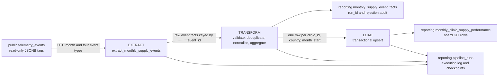

# HealthCore Business Performance Pipeline Design

**Status:** Design only, Milestone 6
**Owner:** HealthCore Digital / Technology
**Audience:** Dr. Sandra Okonkwo, CEO, and Claire Whitfield, Chief Compliance Officer

## 1. Current State

### What exists today

HealthCore already captures telemetry from the backoffice through the shared `TelemetryService` in `uis/backoffice/lib/telemetry.ts`. Events are captured with an envelope containing `eventId`, `timestamp`, `sessionId`, `userId`, `event_type`, `schemaVersion`, `requestId`, and allowlisted event properties. The browser keeps events in memory, flushes them in batches, and retries failed transmissions before dropping a non-critical telemetry batch.

The backend accepts batches at `POST /telemetry/events`. The endpoint validates each event with the existing `TelemetryEvent` contract and stores the event properties in the `tags` JSONB column. The durable source is the append-only `public.telemetry_events` table:

| Column | Role in this design |
| --- | --- |
| `event_id` | Stable source deduplication key from the envelope `eventId`. |
| `timestamp` | Event capture time and the basis for the UTC reporting month. |
| `session_id`, `user_id` | Traceability and operational context; neither is used as a business grouping key. |
| `event_type` | Selects the business event and its transformation rule. |
| `schema_version` | Identifies the event payload contract used at capture time. |
| `request_id` | Joins an event to frontend, backend, and API logs when investigating a gap. |
| `tags` | JSONB copy of the allowlisted event-specific properties. |

The current repository capture catalog includes these events:

- **Clinical and revenue operations:** `claim_submitted`, `claim_denied`, `claim_validation_failed`, `appointment_scheduled`, `appointment_no_show_marked`, `appointment_completed`.
- **Workforce compliance:** `clinician_cme_logged`, `clinician_compliance_calculated`.
- **Existing business rollups:** `billing_denial_rate_calculated`, `no_show_impact_calculated`.
- **Authentication and navigation:** `auth_login_attempted`, `auth_login_failed`, `auth_session_expired`, `navigation_section_opened`, `workflow_abandoned`.
- **Technical health:** `api_latency_recorded`, `frontend_error_occurred`, `backend_unhandled_exception`.
- **Other operational workflows:** `supplier_rate_updated`, `incident_status_changed`.

The separate business-performance context adds the four supply-chain source events listed in Section 2 as the mandatory input contract for this pipeline. They are intentionally called out here because the current technical report does not consume them and the implementation phase must verify their approved event properties, especially the inbound cost field, before the first scheduled run.

The technical report at `GET /telemetry/report`, backed by `services/telemetry/analysis.py`, already answers engineering questions about event volume, volume by event type, error rates, API latency, and authentication failure rates. It remains unchanged. This pipeline is a separate read-only consumer of the same telemetry source.

### The business gap

The existing technical report cannot answer the board question: **What did each of HealthCore's 12 clinics spend on supplies this month, how much supply activity did each clinic record, and where are stockout and expiry risks accumulating?** It reports how the system behaves, not how supply operations perform.

That gap requires a dedicated monthly business pipeline. The pipeline must produce a board-ready, per-clinic, per-country rollup without joining to patient-level tables or exposing PHI. It will serve the business deliverable below, not replace the engineering report.

## 2. Pipeline Purpose and KPI Contract

### Purpose

> **On the first working day of each month, produce the Monthly Clinic Supply Performance Report for Dr. Okonkwo and Claire, computing supply cost, supply consumption volume, critical stockout frequency, and expiry risk from `inbound_order_created`, `outbound_order_created`, `stock_threshold_triggered`, and `supply_expiry_flagged` for the completed UTC calendar month, with USD and GBP reported separately.**

The report is monthly, board-ready, and aggregated at `clinic_id`, `country`, and `month_start`. It is not a patient report and does not attempt currency conversion in v1.

### Required KPIs

| KPI | Business question answered | Output field |
| --- | --- | --- |
| Supply Cost per Clinic | How much did each clinic spend purchasing medical supplies during the month? | `total_supply_cost` |
| Supply Consumption Volume | How many supply-consumption events did each clinic record during the month, and which departments contributed to that activity? | `supply_consumption_count` |
| Critical Stockout Frequency | How many times did a clinic fall below the minimum stock threshold during the month? | `critical_stockout_count` |
| Expiry Risk Count | How many supply batches at a clinic were flagged as approaching expiry during the month? | `expiry_risk_count` |

The board row is one row per clinic per month. `department` is retained in the transformation and reconciliation detail so consumption can be checked by department, but the v1 board table stores the clinic total required by the authoritative context contract. A future department-detail table can be added without changing the board-facing contract.

### Mandatory source event mapping

The pipeline reads only the four mandatory business events defined for this data-pipeline context in v1:

| Source `event_type` | Required properties used | Transformation | KPI fed |
| --- | --- | --- | --- |
| `inbound_order_created` | `clinic_id`, `country`, `quantity`, and a cost value (`total_cost` preferred, or `unit_cost` with `quantity`), plus `currency` when present | Normalize the cost to `total_cost`; sum by clinic, country, and month | Supply Cost per Clinic |
| `outbound_order_created` | `clinic_id`, `country`, `department`, `quantity` | Count valid consumption events by clinic and month; retain department for reconciliation | Supply Consumption Volume |
| `stock_threshold_triggered` | `clinic_id`, `country`, and the threshold/stock status properties from the approved event contract | Count threshold activations by clinic and month | Critical Stockout Frequency |
| `supply_expiry_flagged` | `clinic_id`, `country`, and the expiry-risk properties from the approved event contract | Count expiry flags by clinic and month | Expiry Risk Count |

The data-pipeline context explicitly requires a cost value on `inbound_order_created`. If the earlier event contract has only `unit_cost`, the implementation will derive `total_cost = unit_cost * quantity` in the transform step. If neither cost value is present, the event is rejected from the cost metric and recorded as a data-quality error; it is never silently treated as zero. This is an extension of the existing inbound event payload, not a new event type.

## 3. Extraction Design

### Source and format

The extraction task reads `public.telemetry_events` with a read-only database credential. The query selects:

```text
event_id, timestamp, event_type, schema_version, request_id, tags
```

It filters `event_type` to the four mandatory event names, filters `timestamp` to `[month_start, next_month_start)`, and orders by `timestamp` and `event_id`. `timestamp` is a `timestamptz` and `tags` is JSONB. The extraction boundary converts timestamps to UTC and treats the JSONB object as untrusted input until the transform validation step accepts its allowlisted keys and types.

No patient table, appointment table, claim table, clinician table, or free-text source is joined. The pipeline uses the operational `clinic_id`, `country`, and `department` dimensions already defined for the supply events. Country is validated to `US` or `UK`; the output currency is `USD` for US clinics and `GBP` for UK clinics.

### Frequency and windows

- The scheduled run targets the previous complete UTC calendar month and is ready by the first working day of the current month.
- A manual run accepts an explicit `month_start` for backfills and corrections.
- A late-arrival correction reruns the full affected month rather than adding a delta to the published row.
- Extraction records the requested window, the number of source rows, the maximum source timestamp, and the source query completion time in the execution log.

The full-month read is intentional. It makes late-event correction deterministic and keeps the aggregation independent of how many times a run has already executed.

## 4. Data Flow



### Stage 1: Extraction

`extract_monthly_supply_events` reads the bounded source interval and returns raw event facts plus extraction metadata. It does not mutate `telemetry_events`. The task rejects malformed database rows into the run's data-quality count rather than failing the entire month for a single bad JSONB object.

### Stage 2: Transformation

`transform_monthly_supply_events` performs these operations in order:

1. Convert `timestamp` to UTC and derive `month_start` as the first day of that UTC month.
2. Validate `event_type` and the required property types, including `clinic_id`, `country`, and cost fields where applicable.
3. Deduplicate by `event_id`. A repeated event ID contributes once; the same ID with conflicting payloads is quarantined as a source-quality conflict and does not contribute twice.
4. Normalize inbound cost to `total_cost`, preserving `currency` without converting USD to GBP or GBP to USD.
5. Keep `department` on outbound facts for the reconciliation detail, while aggregating the required board count at clinic level.
6. Group the valid facts by `clinic_id`, `country`, and `month_start`, then calculate the four KPI fields.

The transform is a pure function of the selected source rows and target month. Running it twice with the same source snapshot produces byte-equivalent KPI values.

### Stage 3: Load

`load_monthly_supply_performance` writes the aggregate rows to the reporting schema in one transaction. It upserts on `(clinic_id, month_start)`, updates all four KPI values and `computed_at`, and commits only after every row for the target month is valid. It also records the final run status and row counts in `reporting.pipeline_runs`.

## 5. Reporting Destination

The logical reporting namespace is `reporting.business_metrics`. The canonical v1 output table required by the HealthCore context is `reporting.monthly_clinic_supply_performance`:

| Column | Type | Meaning |
| --- | --- | --- |
| `id` | UUID | Surrogate row identifier. |
| `clinic_id` | TEXT | HealthCore clinic dimension. |
| `country` | TEXT | `US` or `UK`; never mixed in a currency aggregate. |
| `month_start` | DATE | First day of the UTC calendar month. |
| `total_supply_cost` | NUMERIC | Sum of normalized inbound supply cost. |
| `supply_consumption_count` | INTEGER | Count of valid outbound consumption events. |
| `critical_stockout_count` | INTEGER | Count of `stock_threshold_triggered` events. |
| `expiry_risk_count` | INTEGER | Count of `supply_expiry_flagged` events. |
| `currency` | TEXT | `USD` for US or `GBP` for UK. |
| `computed_at` | TIMESTAMPTZ | Last successful computation time. |

The table has `UNIQUE (clinic_id, month_start)`. `country` and `currency` are validated against the clinic's domain values before load. Currency conversion is explicitly out of scope for v1, so US and UK values are displayed side by side rather than summed.

The pipeline also uses an audit table under the same `reporting` schema:

### `reporting.pipeline_runs`

This table stores one row per attempted flow run and is not a business KPI table. It provides operational evidence for the board report's freshness and for recovery after failure. A short-lived `reporting.monthly_supply_event_facts` staging/audit relation may retain `run_id`, `event_id`, normalized `clinic_id`, `department`, `month_start`, inclusion status, and rejection reason for the retention period. It is not exposed as a business metric and contains no patient data.

## 6. Updates, Idempotency, and Re-runs

### Source duplicates

`event_id` is the deduplication key because it is generated at capture time and is the primary key of `telemetry_events`. Extraction uses distinct event IDs, and transformation keeps a single canonical row per ID. A duplicate delivery with the same ID is therefore counted once. If one ID appears with different timestamps or properties, the run records a `SOURCE_EVENT_CONFLICT` data-quality error and excludes that ID until it is reviewed; it never chooses an arbitrary payload silently.

### Existing-record updates

The monthly output is a snapshot, not an append-only event table. The load uses:

```text
INSERT ... ON CONFLICT (clinic_id, month_start)
DO UPDATE SET total_supply_cost = EXCLUDED.total_supply_cost,
              supply_consumption_count = EXCLUDED.supply_consumption_count,
              critical_stockout_count = EXCLUDED.critical_stockout_count,
              expiry_risk_count = EXCLUDED.expiry_risk_count,
              currency = EXCLUDED.currency,
              computed_at = EXCLUDED.computed_at
```

The unique key prevents duplicate published rows. Recomputing the complete month replaces the prior value with the deterministic result for that month, which is necessary when a late event arrives or a source event is corrected.

### Re-run after a load failure

Each run advances through explicit checkpoints: `EXTRACTED`, `TRANSFORMED`, `PUBLISHED`, and `COMPLETED`. The aggregate load and the `PUBLISHED` checkpoint are committed in the same database transaction. If the transaction fails, no partial KPI set is visible. If a process dies after a partial retry or after a transaction acknowledgement is lost, the next run recomputes the month and upserts the same unique keys; it does not add to existing totals. A run is marked `COMPLETED` only after the upsert and row-count verification succeed.

The recovery rule is therefore: **resume from the last durable checkpoint when staging is available, otherwise safely rerun extraction for the target month; never apply an incremental add-on to a previously published monthly total.**

### Late events

A delayed event is assigned to the month in its event `timestamp`, not the time the pipeline received it. The scheduled run recomputes the previous month. If a late event arrives after publication, the scheduler or a manual trigger reruns that month and overwrites the same `(clinic_id, month_start)` row. The report exposes `computed_at` and the run log records the correction, so consumers can distinguish a revised result from a first publication without inflating the KPI.

## 7. Execution Log and Observability

Every attempted run records at least these fields in `reporting.pipeline_runs`:

| Field | Type | Why it is necessary for production audit |
| --- | --- | --- |
| `run_id` | UUID | Correlates Prefect states, staging rows, logs, and the published result. |
| `flow_name` | TEXT | Identifies scheduled, backfill, or correction flow behavior. |
| `trigger_type` | TEXT | Distinguishes schedule from manual or late-event correction. |
| `requested_month_start` | DATE | Identifies the exact business period being computed. |
| `started_at` | TIMESTAMPTZ | Shows when work began and supports duration analysis. |
| `ended_at` | TIMESTAMPTZ NULL | Shows completion time; null indicates an unfinished run. |
| `status` | TEXT | One of `RUNNING`, `COMPLETED`, `FAILED`, or `CANCELLED`. |
| `checkpoint` | TEXT | Shows the last durable stage reached during recovery. |
| `records_extracted` | INTEGER | Detects source silence and validates the extraction boundary. |
| `records_processed` | INTEGER | Shows how many rows reached transformation. |
| `records_published` | INTEGER | Confirms the number of aggregate rows made visible. |
| `records_rejected` | INTEGER | Makes data-quality loss visible rather than hiding it in a zero KPI. |
| `source_max_timestamp` | TIMESTAMPTZ NULL | Shows the source watermark used to distinguish fresh input from silence. |
| `error_code` | TEXT NULL | Supports safe, searchable failure classification without secrets or stack traces. |
| `error_message` | TEXT NULL | Gives operators a sanitized explanation of the failure. |

### Silence versus true absence

The pipeline does not interpret an empty KPI result by itself. A successful run with `records_extracted = 0`, a completed source query, and a current telemetry source watermark is a true zero-activity month. A missing or stale source watermark, a failed extraction, or an absent `pipeline_runs` row means source or pipeline silence and is reported as unavailable rather than as zero. `records_rejected` and `records_published` make a data-quality gap visible as a third case.

### Collection traceability

The path from event to board number is reconstructable through `request_id` to API logs, `event_id` to the source row, `run_id` to the staging/audit facts, and `(clinic_id, month_start)` to the final board row. A reviewer can answer which source events contributed to a number, which events were rejected, which run published it, and whether a correction later replaced it.

### Growth versus data loss

The report never treats raw event volume as business growth. For each month, operations compare the four business counts with ingestion signals: accepted source rows, distinct `event_id` count, rejected rows, duplicate/conflict count, source watermark, and telemetry delivery failures. A rise in outbound consumption with stable collection health is a business activity change. A simultaneous fall in all event types, a stale watermark, or a spike in rejected/undelivered events is a capture or pipeline problem and is flagged as data loss risk.

## 8. Recoverability and Operational Failure Cases

### Database outage

The extraction checkpoint is persisted after the source query and validation metadata are complete. Transformation can resume from the durable staging facts if the reporting database becomes unavailable during load. If the outage occurs before that checkpoint, the next run repeats the bounded read. The final aggregate upsert is transactional, so a database outage cannot expose half a month's KPI rows. Prefect retries transient connection errors with bounded backoff, then records `FAILED` with a sanitized `error_code` if the outage persists.

### Frontend buffer

The frontend telemetry buffer is not a durable source of truth and is not owned by this business pipeline. It batches events and retries transient failures, but it may lose data when a browser is closed after retries are exhausted. This pipeline reports what reached `telemetry_events`; it must not fabricate missing business activity. For a future requirement that supply orders be lossless, the server-side inventory order record should become the source of truth and emit a durable event, rather than making the browser buffer responsible for financial or safety reporting.

### Transmission retry

The telemetry sender retries a batch only for a transient failure. A successful `200` means the batch was accepted. A `503` means the same batch can be retried with the same `eventId` values. A `4xx` contract rejection is not retried unchanged; it is recorded for data-quality review. The source primary key and the transformation deduplication key make a retried accepted batch idempotent. A repeated event ID with a conflicting payload is quarantined as a conflict rather than double-counted.

### Concurrent runs

Prefect deployment concurrency is limited to one active run for a given `month_start`. The flow acquires a month-scoped advisory/lease lock before extraction; a manual trigger for an already-running month returns the existing `run_id` or a conflict response instead of starting a second writer. The database unique key remains the final guard against duplicate output. A failed lease is released by timeout and reconciled from the execution log before another run is allowed to continue.

## 9. Prefect Mapping

### Flows

1. **`monthly_clinic_supply_performance_flow`**: scheduled on the first working day, targets the previous UTC month, and produces the board-ready report.
2. **`monthly_clinic_supply_backfill_flow`**: manually invoked with `month_start`, reruns a historical month after late events or a corrected source record.

The implementation composes those entry flows from three reusable subflows:

1. **`extract_monthly_clinic_supply_events_flow`**: reads the bounded `telemetry_events` source window.
2. **`transform_monthly_clinic_supply_performance_flow`**: validates, deduplicates, and aggregates the four clinic supply KPIs.
3. **`load_monthly_clinic_supply_performance_flow`**: transactionally publishes the result to `reporting.monthly_clinic_supply_performance`.

The optional `publish_business_performance_notification_flow` is invoked with `return_state=True`, so a notification outage cannot block a completed KPI load.

Both flows call the same tasks and publish the same table contract. The difference is trigger metadata and the requested period, not business logic.

### Tasks

1. **`start_pipeline_run`**: creates the `RUNNING` execution row and obtains the month-scoped lock.
2. **`extract_monthly_supply_events`**: reads the four event types from `public.telemetry_events` and persists the `EXTRACTED` checkpoint.
3. **`validate_and_deduplicate_supply_events`**: validates JSONB properties, deduplicates by `event_id`, records rejection/conflict facts, and persists `TRANSFORMED` input.
4. **`aggregate_monthly_clinic_supply_metrics`**: computes the four KPI fields at `clinic_id`, `country`, `month_start` grain and verifies currency separation.
5. **`publish_monthly_clinic_supply_performance`**: transactionally upserts `reporting.monthly_clinic_supply_performance`, verifies row counts, and records `PUBLISHED`.
6. **`complete_pipeline_run`**: records `COMPLETED` with end time and metrics, or records `FAILED` with a sanitized error classification.

Relevant Prefect states are `Running` while tasks execute, `Completed` only after the reporting transaction and execution log update commit, and `Failed` when a retry policy is exhausted or a validation invariant cannot be satisfied. A cancelled run remains distinguishable from a failed run.

### Prefect blocks and configuration

- **Supabase source block:** read-only connection to `public.telemetry_events`.
- **Supabase reporting block:** write connection restricted to the `reporting` schema.
- **Secret blocks:** database URLs, service keys, and Prefect API credentials; no credentials are stored in this Markdown file or in source control.
- **Configuration block:** target schema/table names, event allowlist, UTC schedule, retry count, late-arrival policy, and staging retention period.
- **Notification block:** sanitized failure notifications to the Technology team and a board-report freshness alert when the first-working-day SLA is missed.
- **Concurrency/work-pool configuration:** one active run per `month_start`, with a bounded worker timeout.

## 10. Application Integration Design

The business-facing API is intentionally separate from `services/telemetry/` and `GET /telemetry/report`. No ETL logic belongs in `services/`; those routes import functions from `data/pipelines/`.

### Planned endpoints

| Method and path | Purpose | Pipeline function imported |
| --- | --- | --- |
| `GET /reporting/monthly-clinic-supply-performance?month_start=YYYY-MM-01` | Return all clinic rows for the requested month, or the most recent completed month when omitted. | `data.pipelines.monthly_supply_performance.read_monthly_report` |
| `GET /reporting/pipeline-runs/latest` | Return status, period, timestamps, counts, checkpoint, and sanitized error metadata for the latest run. | `data.pipelines.run_history.get_latest_run` |
| `POST /reporting/pipeline-runs` | Validate an optional `month_start` and request a scheduled-equivalent or backfill run through Prefect. | `data.pipelines.monthly_supply_performance.trigger_monthly_run` |

The reporting module will be `services/reporting/`, with its own router and response schemas. It will not import `services/telemetry/analysis.py`, mutate `telemetry_events`, or call `GET /telemetry/report`. The manual trigger returns a `run_id` and initial status so the caller can poll the status endpoint.

## 11. Risks, Exclusions, and Decisions

- **No patient data:** no output, staging record, endpoint, or execution log contains patient IDs, diagnoses, names, contact data, or simulated PHI. Aggregation remains at clinic and department operational dimensions.
- **No currency conversion in v1:** US `USD` and UK `GBP` remain separate. FX conversion requires a governed rate source and belongs to v2.
- **No source mutation:** the pipeline reads `telemetry_events` only and never updates or deletes telemetry.
- **No technical KPIs in this output:** API latency, error rate, authentication failures, and event volume continue to belong to the technical telemetry report.
- **Missing cost is visible:** an inbound event without a usable cost is rejected from `total_supply_cost` and counted in the run's data-quality fields; it is not silently imputed as zero.
- **Department grain is deliberate:** the board destination remains the required clinic-month contract. Department is retained for reconciliation and can support a later drilldown table without changing the executive report.
- **Telemetry loss is not silently repaired:** browser-buffer loss is an ingestion limitation, not evidence of zero supply activity. The run log and source watermark make that limitation visible.
- **Retention:** source event retention and staging/audit retention must be approved by Compliance. The design assumes staging facts are retained only long enough to support audit and correction, while the monthly aggregate remains the board record.

## 12. Design Checklist

- [x] Current telemetry capture, storage, and technical report are documented.
- [x] The unanswered business question and dedicated pipeline are explicit.
- [x] Purpose names the business deliverable, audience, cadence, KPIs, and mandatory source metrics.
- [x] Extraction format, source table, event filter, UTC window, and update cadence are specified.
- [x] Mermaid flow separates extraction, transformation, and load using real HealthCore table names.
- [x] Existing output updates use a concrete unique-key upsert strategy.
- [x] Duplicate events, partial reruns, late events, silence, traceability, growth versus loss, outage, buffering, retry, and concurrency are addressed.
- [x] Execution logging includes typed fields and audit justifications.
- [x] Prefect flows, tasks, states, blocks, secrets, and concurrency are mapped.
- [x] Reporting endpoints are separated from telemetry and name their future pipeline imports.
- [x] Patient data, currency mixing, and changes to the existing telemetry report are explicitly excluded.

## Reference Context

This design follows the HealthCore business-performance context for the data-pipelines milestone and the repository's approved telemetry envelope/storage design. The authoritative business context is the syllabus file `CONTEXT-healthcore.md` under `06-telemetry-data-pipelines/data-pipelines`; the repository-specific context files remain the domain vocabulary reference for HealthCore entities and compliance constraints.

## Implementation Command

From the repository root, run `uv run --project services/api python data/pipelines/pipeline.py`. If the `services/api` virtual environment is activated, `python data/pipelines/pipeline.py` runs the same flow. The scheduled deployment targets the previous complete UTC calendar month on the first working day; `--month-start YYYY-MM-01` is available for a manual backfill.

The transformation tests run from the repository root with `uv run --project services/api python -m pytest tests/pipelines/test_pipeline.py`. With `services/api/.venv` activated, the equivalent command is `python -m pytest tests/pipelines/test_pipeline.py`.
